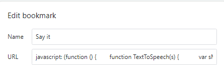
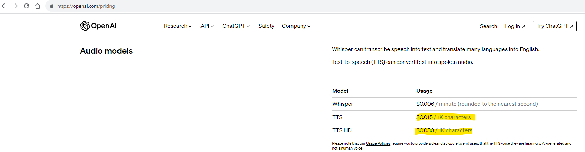

# OpenAI Text to Speech in Browser

Originally posted here:
https://www.codeproject.com/Tips/5372899/OpenAI-Text-to-Speech-in-Browser

This program is implemented as a JavaScript Bookmarklet that uses Open AI TTS API

## Introduction

This program is implemented as a JavaScript Bookmarklet (https://en.wikipedia.org/wiki/Bookmarklet) that uses OpenAI TTS API (https://platform.openai.com/docs/guides/text-to-speech). It should work in any browser including Chrome, Edge and Firefox.

## Using the Code

1. First, get API Key from Open AI https://platform.openai.com/account/api-keys.
2. Copy the code below to Notepad and replace "YOUR OPEN AI API KEY HERE" with your key.
3. Create a bookmark in your browser. (You can do this by dragging any URL to the Bookmark bar.)
4. Right click on the bookmark and click Edit. Change name to "Say it" and URL to the JavaScript below.
5. Select any text on the page and click Say it to hear it spoken to you.

Current OpenAI pricing is $15 per 1,000,000 characters.

